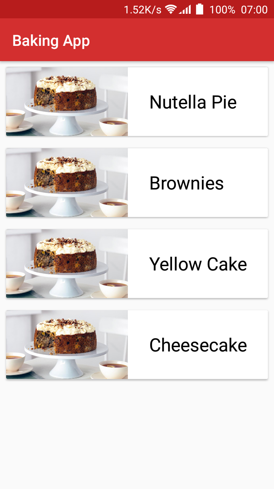
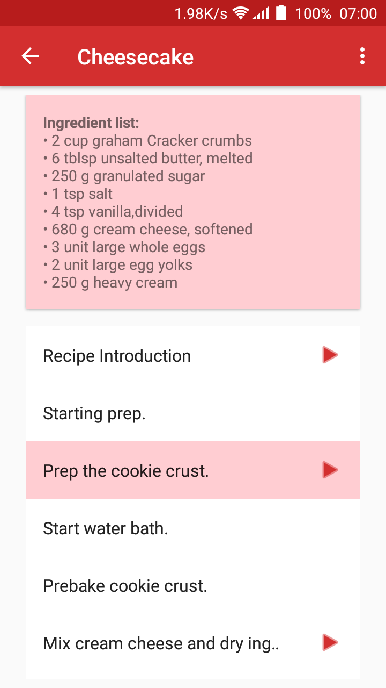
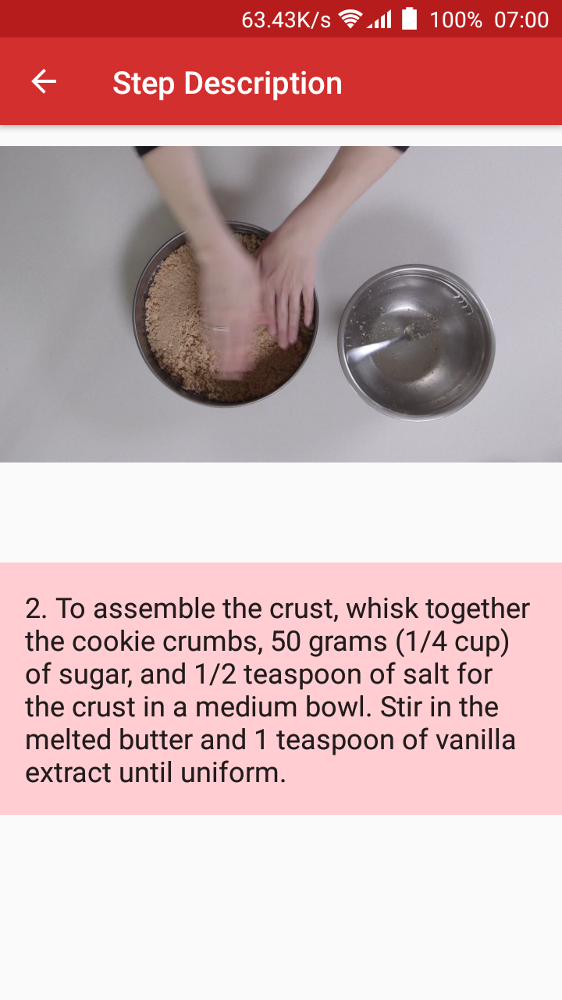
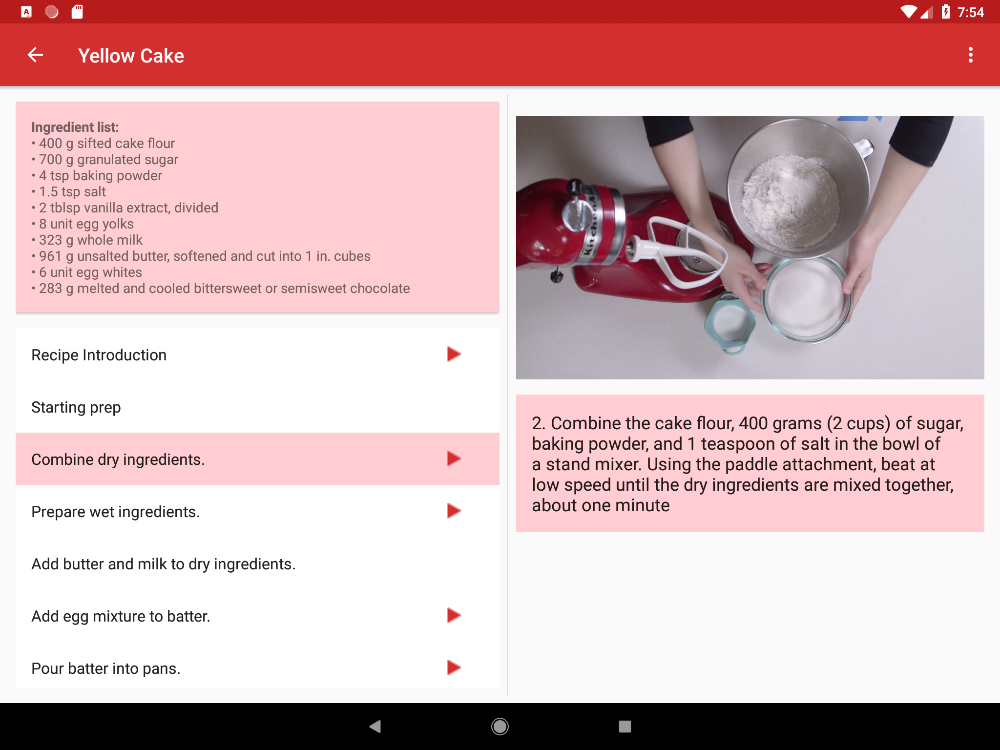

# Baking App

## Project Overview
App displays a list of recipes from a back-end RESTful API web service including the required ingredients. Videos are displayed for some of the preparation instructions.

## Screenshot
  
 
 
 

## App features
* Uses Exoplayer to display videos.
* Has a widget to enhance app experience.
* Makes use of Espresso to test aspects of the UI.
* Uses Fragments to create a responsive design that works on phones and tablets.

## Getting Started

The app uses the Gradle build system. To build this project, use the
"gradlew build" command or use "Import Project" in Android Studio.

## Prerequisites

- Android SDK v28
- Android Build Tools v27.0.3
- Android Support Repository v28.0.0
- Gradle 3.2.1

## Libraries
*   [Retrofit 2](https://github.com/square/retrofit)
*   [Gson](https://github.com/google/gson)
*   [LiveData](https://developer.android.com/topic/libraries/architecture/livedata)
*   [ViewModel](https://developer.android.com/topic/libraries/architecture/viewmodel)
*   [Room](https://developer.android.com/topic/libraries/architecture/room)
*   [Picasso](http://square.github.io/picasso/)
*   [Exoplayer](https://github.com/google/ExoPlayer)
*   [Espresso](https://developer.android.com/training/testing/espresso)
*   [Timber](https://github.com/JakeWharton/timber)

## Author

Zizoh Anto

## License

This project is licensed under the Apache License 2.0 - See: http://www.apache.org/licenses/LICENSE-2.0.txt
